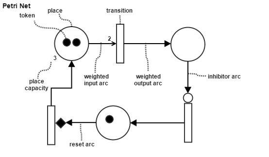
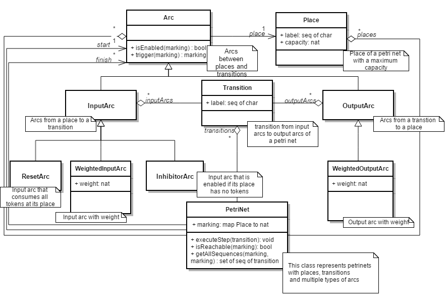

Formal Modelling of a Petri Net in VDM++
----------------------------------------

## Summary

> The goal of this project is to model the structure and behaviour of a [Petri net](http://en.wikipedia.org/wiki/Petri_net) in [VDM++](http://en.wikipedia.org/wiki/Vienna_Development_Method).

> A Petri net is mathematical modelling language for the description of distributed systems. It is typically
represented by a graphical notation for stepwise processes that include choice, iteration and cocurrent execution.

> In order to build the executable formal model, the model-oriented specification language from the Vienna
Development Method (VDM++) was used, as well as the [Overture Tool](http://overturetool.org/) for development.

Further info: [report](report/formal-modelling-petri.pdf) (pdf)

## Authors

- [Duarte Duarte](https://github.com/dduarte) - ei11101
- [Ruben Cordeiro](https://github.com/rubencordeiro) - ei11097

## Diagrams

UML class diagram
